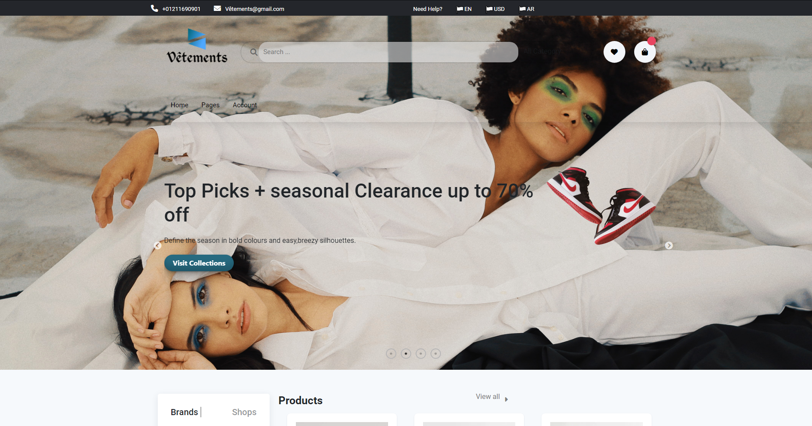
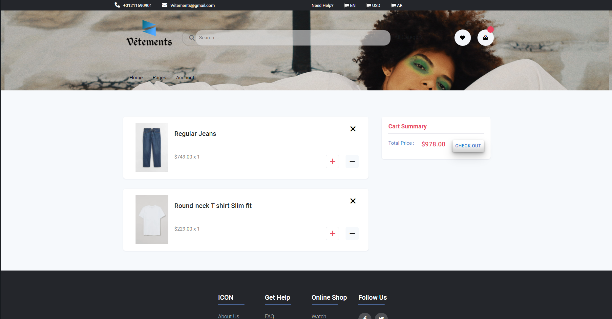

# VETEMENTS-E-Commerce-website-with-MERN-Stack
Build an E-Commerce website with MERN Stack and Microservices with API Gateway and http calls between the Frontend as React and the Backend as NodeJS
<h2>Index page</h2>

<h2>Registration Page</h2>

<h2>Database of the Clients</h2>

<h2>Home Page</h2>

<h2>View Products</h2>

<h2>View products Database</h2>

<h2>Add Products and Delete Products by Postman</h2>

<h2>Product added successfully</h2>

<h2>Add to your Wishlist</h2>

<h2>Wishlist Database</h2>

<h2>Checkout</h2>

<h2>Checkout Database</h2>

<h2>Your order is successfully completed</h2>

<h2>Microservices Postman</h2>

